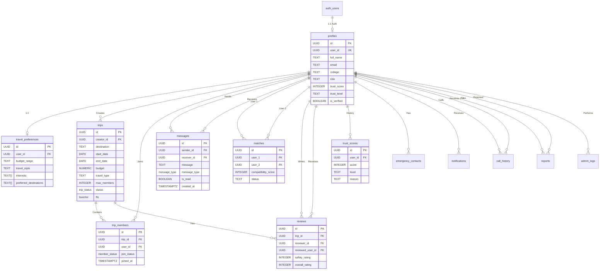

# RAAHI Database Entity-Relationship Diagram

Below is the Mermaid representation of the RAAHI production database schema.

```mermaid
erDiagram
    auth_users ||--o| profiles : "1:1 Auth"
    profiles ||--o| travel_preferences : "1:1"
    profiles ||--o{ trips : "Creates"
    profiles ||--o{ trip_members : "Joins"
    trips ||--o{ trip_members : "Contains"
    profiles ||--o{ messages : "Sends"
    profiles ||--o{ messages : "Receives"
    profiles ||--o{ matches : "User 1"
    profiles ||--o{ matches : "User 2"
    profiles ||--o{ reviews : "Writes"
    profiles ||--o{ reviews : "Receives"
    trips ||--o{ reviews : "Has"
    profiles ||--o{ trust_scores : "History"
    profiles ||--o{ emergency_contacts : "Has"
    profiles ||--o{ notifications : "Receives"
    profiles ||--o{ call_history : "Calls"
    profiles ||--o{ call_history : "Receives Call"
    profiles ||--o{ reports : "Files"
    profiles ||--o{ reports : "Reported"
    profiles ||--o{ admin_logs : "Performs"

    profiles {
        UUID id PK
        UUID user_id UK
        TEXT full_name
        TEXT email
        TEXT college
        TEXT role
        INTEGER trust_score
        TEXT trust_level
        BOOLEAN is_verified
    }

    travel_preferences {
        UUID id PK
        UUID user_id FK
        TEXT budget_range
        TEXT travel_style
        TEXT[] interests
        TEXT[] preferred_destinations
    }

    trips {
        UUID id PK
        UUID creator_id FK
        TEXT destination
        DATE start_date
        DATE end_date
        NUMERIC budget
        TEXT travel_type
        INTEGER max_members
        trip_status status
        tsvector fts
    }

    trip_members {
        UUID id PK
        UUID trip_id FK
        UUID user_id FK
        member_status join_status
        TIMESTAMPTZ joined_at
    }

    matches {
        UUID id PK
        UUID user_1 FK
        UUID user_2 FK
        INTEGER compatibility_score
        TEXT status
    }

    messages {
        UUID id PK
        UUID sender_id FK
        UUID receiver_id FK
        TEXT message
        message_type message_type
        BOOLEAN is_read
        TIMESTAMPTZ created_at
    }

    reviews {
        UUID id PK
        UUID trip_id FK
        UUID reviewer_id FK
        UUID reviewed_user_id FK
        INTEGER safety_rating
        INTEGER overall_rating
    }

    trust_scores {
        UUID id PK
        UUID user_id FK
        INTEGER score
        TEXT level
        TEXT reason
    }
```
